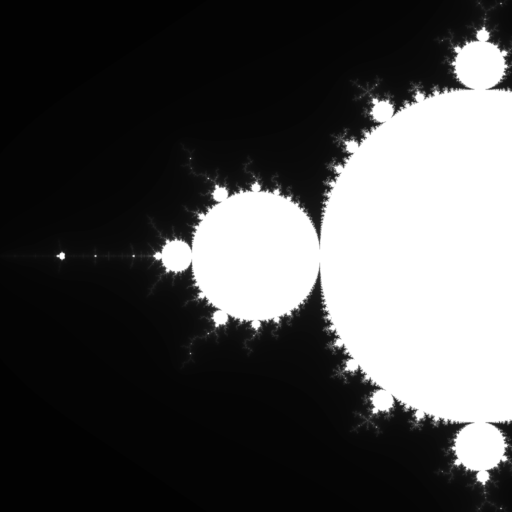

## Vulkan Learning

A repo for my Vulkan learning journey, starting with a loose following of the tutorials on https://vulkano.rs/ and my extension of the concepts within.

So far, I've just been getting to grips with using Vulkan and Rust together. I've chosen the `vulkano` bindings due to their Rust-i-ness, as opposed to the more C++ like nature of `vulkanalia`.

You can follow along by pulling the repo. 

```bash
git clone https://github.com/TotallyNotBiased/vulkan-learning.git
```

If you're not on Nix, inspect `flake.nix` for the libraries you'll need, otherwise just

```bash
nix develop
```

and

```bash
cargo run --bin zoom_fractal
```

to see the latest project, which is a `winit` surface where you can zoom and drag around on the Mandelbrot set. It's entirely done via a compute shader.

## Images

### Mandelbrot Set Output

### Mandelbrot Zoom 

